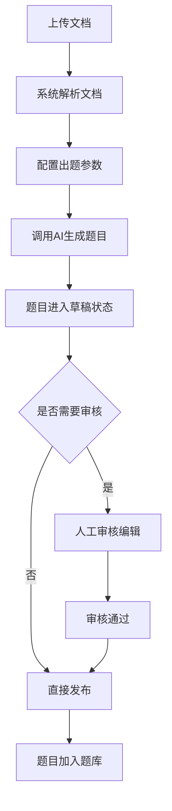
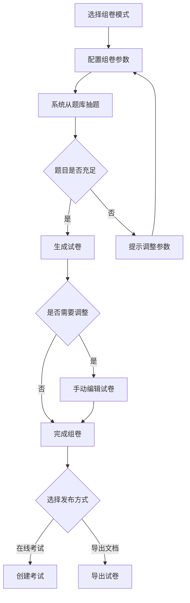
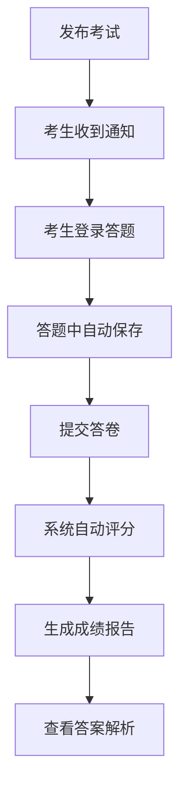
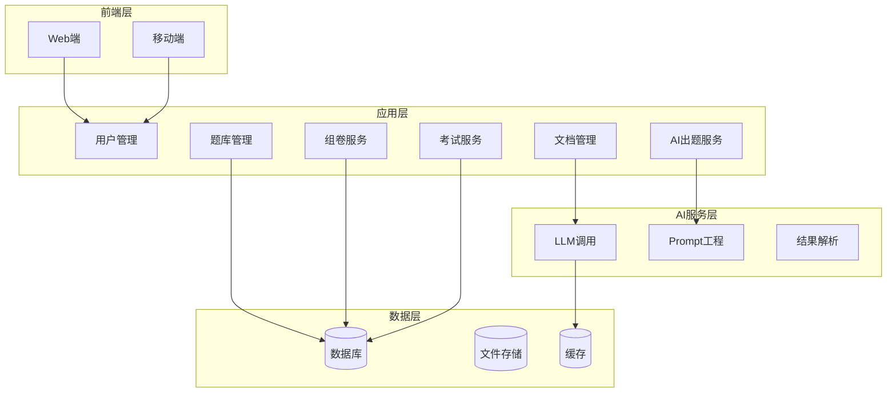

# 智能题库与考试系统 PRD

## 文档信息

| 项目 | 内容 |
|------|------|
| 产品名称 | 智能题库与考试系统 |
| 文档版本 | v1.1 |
| 创建日期 | 2026-01-27 |
| 产品类型 | 通用工具 |

---

## 1. 产品概述

### 1.1 产品定位

本产品是一个基于大语言模型的智能题库生成与考试管理系统，能够从各类文档（PDF、Word、图片等）中自动提取知识点并生成结构化题库，支持灵活的组卷策略和在线考试功能。

### 1.2 核心价值

- **高效出题**：通过AI技术自动从文档生成题目，大幅降低人工出题成本
- **智能组卷**：根据题型、数量、难度等维度快速生成符合要求的试卷
- **精准溯源**：每道题目保留来源文档、页码、条款号等信息，便于追溯和验证
- **灵活考试**：支持在线考试和试卷导出两种模式，满足不同场景需求

### 1.3 目标用户

- 企业人力及培训部门：用于员工培训考核、合规考试

---

## 2. 功能需求

### 2.1 文档上传与解析

#### 2.1.1 文档上传

**功能描述**：支持用户上传用于出题的源文档

**支持格式**：
- 文档类：PDF (.pdf)、Word (.docx)、纯文本 (.txt)
- 可扩展：Markdown、PPT等

**功能要求**：
- 单文件大小限制：≤50MB
- 批量上传：支持一次上传多个文档
- 上传进度显示
- 文件格式校验与错误提示

#### 2.1.2 文档解析

**功能描述**：将上传的文档解析为结构化内容，供AI模型调用

**核心能力**：
- PDF文本提取（支持多栏布局、表格识别）
- Word文档结构解析（保留标题层级）
- 元数据提取（页码、章节、条款号等）

**数据输出**：
```
文档元数据：标题、作者、创建时间、总页数
内容分块：按章节/段落分块
结构信息：标题层级、列表项、表格数据
定位信息：页码范围、章节路径
```

### 2.2 AI智能出题

#### 2.2.1 题型定义

| 题型 | 说明 | 示例 |
|------|------|------|
| 选择题 | 单选/多选，包含题干、选项、正确答案、解析 | 以下哪项属于...？ |
| 填空题 | 包含题干、空格标注、正确答案、答案容忍度 | _____是XX的核心原则。 |
| 判断题 | 包含陈述、正误判断、解析 | XX的说法是否正确？ |
| 问答题 | 包含问题、参考答案、评分要点 | 请简述XX的三个特点。 |

#### 2.2.2 出题参数配置

**用户输入参数**：
- **题型选择**：勾选需要生成的题型（可多选）
- **题目数量**：各题型的生成数量
- **难度分布**：1-5星各等级的比例或数量
- **知识范围**：指定文档的章节范围
- **出题粒度**：按知识点、按段落、按页面

**AI出题逻辑**：
1. 解析用户配置的出题参数
2. 分析文档内容，识别关键知识点
3. 调用大模型生成对应题型的题目
4. 自动标注题目的元数据属性
5. 生成题目解析和评分要点

#### 2.2.3 题目元数据

每道题目必须包含以下属性：

| 属性 | 说明 | 示例 |
|------|------|------|
| 题目ID | 全局唯一标识 | Q-20260127-0001 |
| 题型 | 选择题/填空题/判断题/问答题 | 选择题 |
| 题目标签 | 关键词标签，便于检索 | 数据结构, 树, 遍历 |
| 来源文档 | 来源文档名称 | 《数据结构与算法》.pdf |
| 页码 | 在原文档中的页码 | P45-46 |
| 章节号 | 所在章节 | 第3章 3.2节 |
| 规范条款号 | 对应的条款编号（如适用） | 条款6.1.2 |
| 难度等级 | 1-5星（1最简单，5最困难） | 3星 |
| 知识点 | 关联的知识点 | 二叉树的遍历 |
| 题目内容 | 题干的完整文本 | ... |
| 选项/答案 | 选项内容或参考答案 | A.前序遍历... |
| 正确答案 | 标准答案 | A |
| 解析 | 题目解析 | 前序遍历是指... |
| 创建时间 | 题目生成时间 | 2026-01-27 10:30:00 |
| 状态 | 草稿/已审核 | 已审核 |

### 2.3 题库管理

#### 2.3.1 题目审核（可选功能）

**功能描述**：用户可对AI生成的题目进行审核、编辑和修正

**核心能力**：
- 题目列表展示（支持筛选、排序、搜索）
- 单题查看与编辑
- 批量操作（批量审核、批量删除、批量修改难度）
- 审核状态流转：草稿 → 待审核 → 已审核 → 已发布

**审核编辑项**：
- 修改题目内容、选项、答案
- 调整难度等级
- 补充或修正解析
- 修改元数据（页码、条款号等）
- 添加审核备注

#### 2.3.2 题库检索与筛选

**检索维度**：
- 关键词搜索（题干内容、选项、解析）
- 题型筛选
- 难度筛选
- 来源文档筛选
- 章节范围筛选
- 创建时间筛选

**排序方式**：
- 按创建时间
- 按难度等级
- 按使用频率
- 按正确率（如有考试数据）

#### 2.3.3 题目标签管理

**功能描述**：为题目添加标签，便于分类和检索

**标签类型**：
- 知识点标签
- 章节标签
- 自定义标签

**操作**：
- 手动打标签
- AI自动打标签（基于题目内容）
- 批量打标签
- 标签合并与管理

### 2.4 试卷生成

#### 2.4.1 组卷参数配置

**用户输入参数**：

| 参数项 | 说明 | 示例 |
|--------|------|------|
| 试卷名称 | 试卷的名称 | 2026年第一季度数据结构考试 |
| 试卷总分 | 试卷满分 | 100分 |
| 题型配置 | 各题型的数量和分值 | 选择题20道×2分=40分 |
| 难度配置 | 1-5星各等级的比例或数量 | 1星10%、2星20%、3星40%、4星20%、5星10% |
| 知识范围 | 指定章节或文档范围 | 第3-5章 |
| 避免重复 | 与历史试卷的题目重复率控制 | 重复率<10% |
| 题目来源 | 指定来源文档 | 仅从文档A抽取 |

#### 2.4.2 抽题策略

**抽题逻辑**：
1. 根据题型、难度、知识范围构建查询条件
2. 从题库中筛选符合条件的题目池
3. 题目数量不足时，给出提示并降低条件
4. 随机抽取题目组成试卷
5. 试卷预览与调整

**智能推荐**（可选）：
- 基于历史考试数据推荐题目
- 避免选择正确率过高或过低的题目
- 保证知识点覆盖的均衡性

#### 2.4.3 试卷编辑

**功能描述**：对生成的试卷进行手动调整

**操作**：
- 手动添加/删除/替换题目
- 调整题目顺序
- 修改题目分值
- 预览试卷效果
- 保存为试卷模板

### 2.5 在线考试

#### 2.5.1 考试发布

**功能描述**：将生成的试卷发布为在线考试

**配置项**：
- 考试名称与说明
- 考试时间范围（开始时间、结束时间）
- 考试时长限制
- 答题次数限制
- 及格分数线
- 参考人员（全体/指定人员）
- 考试设置（乱序出题、显示答案解析等）

#### 2.5.2 答题界面

**核心功能**：
- 题目展示（支持富文本、图片、公式）
- 答题进度显示
- 题目导航（快速跳转）
- 倒计时显示
- 暂存/提交答卷
- 标记疑难题目

**交互要求**：
- 响应式设计，支持PC和移动端
- 自动保存答案，防止意外退出
- 友好的错误提示和操作反馈

#### 2.5.3 自动评分

**评分规则**：

| 题型 | 评分方式 |
|------|----------|
| 选择题 | 完全匹配，自动给分 |
| 判断题 | 完全匹配，自动给分 |
| 填空题 | 关键词匹配或相似度匹配 |
| 问答题 | AI辅助评分或人工评分 |

**问答题评分标准**：

问答题采用分项评分法，从多个维度综合评估答案质量：

| 评分维度 | 权重 | 评分要点 |
|---------|------|----------|
| **内容完整性** | 40% | 是否覆盖了参考答案中的所有关键点 |
| **准确性** | 30% | 答案是否正确，无明显错误 |
| **逻辑性** | 20% | 论述是否有条理，逻辑是否清晰 |
| **表达规范性** | 10% | 语言表达是否规范、通顺 |

**AI辅助评分流程**：

1. **关键词提取**：从参考答案中提取N个关键知识点
2. **相似度匹配**：计算考生答案与参考答案的语义相似度
3. **完整性评估**：检查是否遗漏关键知识点
4. **逻辑分析**：评估答案的论述逻辑
5. **分数计算**：根据各维度权重计算最终得分

**评分细则**：

- **满分**：所有关键点都覆盖，表述准确，逻辑清晰
- **80%-90%分**：覆盖主要关键点，偶有小错但不影响整体理解
- **60%-80%分**：覆盖部分关键点，有一些理解偏差或表述不清
- **40%-60%分**：仅覆盖少量关键点，有明显理解错误
- **0%-40%分**：完全偏离题意或未作答

**评分标准示例**：

假设题目："请简述二叉树的三种遍历方式及其特点"（满分10分）

参考答案要点：
- 前序遍历：根-左-右（2分）
- 中序遍历：左-根-右（2分）
- 后序遍历：左-右-根（2分）
- 各自特点说明（4分）

评分规则：
- 完整写出三种遍历方式得6分，每少一种扣2分
- 正确说明特点得4分，根据完整性和准确性酌情给分
- 顺序错误但不影响理解扣1-2分
- 表述不清、逻辑混乱扣1-2分

**人工评分模式**：

- 教师可查看AI参考评分作为建议
- 支持手动调整分数
- 可添加评分评语和批注
- 支持评分标准自定义（修改各维度权重）

**评分流程**：
1. 客观题自动评分
2. 主观题可选AI辅助评分或人工评分
3. 生成成绩报告
4. 显示答案解析（根据设置）

#### 2.5.4 成绩管理

**功能项**：
- 成绩列表查看
- 成绩统计分析（平均分、及格率、分数分布）
- 成绩导出（Excel、PDF）
- 试卷作答详情查看
- 错题集生成

### 2.6 试卷导出

#### 2.6.1 导出格式

**支持格式**：
- Word文档 (.docx)
- PDF文档 (.pdf)
- 可扩展：HTML、LaTeX

#### 2.6.2 导出内容

**试卷内容**：
- 试卷标题与说明
- 题目列表（题干、选项、答题空）
- 答题卡（选择题）
- 装订线（如需要）

**参考答案**（可选）：
- 单独导出答案文档
- 或附在试卷末尾

**样式定制**：
- 试卷模板选择
- 字体、字号、行距设置
- 页眉页脚设置

---

## 3. 数据模型设计

### 3.1 核心实体

```
文档（Document）
├─ 文档ID
├─ 文档名称
├─ 文件路径
├─ 文件类型
├─ 文件大小
├─ 上传时间
├─ 解析状态
└─ 元数据（作者、创建时间等）

题目（Question）
├─ 题目ID
├─ 题型
├─ 题目内容
├─ 选项/答案
├─ 正确答案
├─ 解析
├─ 难度等级
├─ 来源文档ID（外键）
├─ 页码
├─ 章节号
├─ 规范条款号
├─ 状态
└─ 创建时间

试卷（Paper）
├─ 试卷ID
├─ 试卷名称
├─ 总分
├─ 组卷配置（JSON）
├─ 创建时间
└─ 关联题目（多对多关系）

考试（Exam）
├─ 考试ID
├─ 考试名称
├─ 关联试卷ID（外键）
├─ 开始时间
├─ 结束时间
├─ 时长限制
├─ 及格分数
├─ 考试设置（JSON）
└─ 状态

答卷（AnswerSheet）
├─ 答卷ID
├─ 考试ID（外键）
├─ 考生ID
├─ 开始答题时间
├─ 提交时间
├─ 得分
├─ 答题详情（JSON）
└─ 状态

标签（Tag）
├─ 标签ID
├─ 标签名称
├─ 标签类型
└─ 使用次数

题目-标签关联（QuestionTag）
├─ 题目ID（外键）
├─ 标签ID（外键）
└─ 创建时间
```

### 3.2 数据关系

- 一个文档可以生成多个题目
- 一个题目属于一个文档
- 一个试卷包含多个题目
- 一个题目可以被多个试卷使用
- 一个考试对应一个试卷
- 一个考试可以产生多个答卷
- 一个题目可以有多个标签

---

## 4. 交互流程

### 4.1 出题流程



### 4.2 组卷流程



### 4.3 考试流程



---

## 5. 非功能需求

### 5.1 性能要求

| 指标 | 要求 |
|------|------|
| 文档上传响应时间 | <2秒（小文件） |
| 文档解析时间 | 10页/分钟 |
| AI出题速度 | 5题/分钟 |
| 组卷响应时间 | <3秒 |
| 页面加载时间 | <2秒 |
| 并发支持 | 500人同时在线考试 |

### 5.2 安全要求

- 文档内容加密存储
- 题库访问权限控制
- 考试防作弊机制（基础）：考试时间限制、切屏检测
- 数据备份与恢复机制
- 操作日志记录

### 5.3 可用性要求

- 系统可用性：≥99.5%
- 界面友好性：简洁直观，用户无需培训即可使用
- 帮助文档：提供完整的操作指南

### 5.4 兼容性要求

- 浏览器支持：Chrome、Firefox、Safari、Edge（近两个版本）
- 移动端：iOS 12+、Android 8+
- 文档格式：PDF 1.7+、Word 2007+

---

## 6. 技术架构建议

### 6.1 技术栈选型

| 层次 | 技术选型 | 说明 |
|------|----------|------|
| 前端 | React/Vue + TypeScript | 现代化前端框架 |
| 后端 | Python/Node.js + FastAPI/Express | 高性能API服务 |
| 数据库 | PostgreSQL/MySQL | 关系型数据库 |
| 文件存储 | MinIO/OSS | 对象存储 |
| AI模型 | OpenAI API / Claude API / 自建模型 | 大语言模型 |
| 文档解析 | PyPDF2、python-docx、Tesseract OCR | 文档解析库 |
| 部署 | Docker + Kubernetes | 容器化部署 |

### 6.2 系统架构图



### 6.3 AI Prompt设计要点

**出题Prompt结构**：
```
角色设定：你是一个专业的出题专家
任务：根据提供的文档内容生成题目
要求：
1. 题型：{题型}
2. 数量：{数量}
3. 难度：{难度等级}
4. 知识点：{指定章节}
5. 输出格式：JSON格式，包含题目、选项、答案、解析
6. 必须包含元数据：页码、条款号、难度评估

输入文档：
{文档内容片段}

请严格按照要求生成题目。
```

---

## 7. 迭代规划

### 7.1 MVP版本（v1.0）

**核心功能**：
- 文档上传与解析（PDF、Word）
- AI生成4种题型（选择、填空、判断、问答）
- 基础题库管理（查看、编辑、删除）
- 简单组卷功能（按题型、数量）
- 试卷导出（Word格式）
- 基础在线考试（自动评分客观题）

**预期时间**：3个月

### 7.2 后续迭代方向

#### v1.1 版本

- 支持图片OCR识别
- 增强题库管理功能（标签、高级检索）
- 试卷模板管理
- 考试数据分析与统计
- 错题本功能

#### v1.2 版本

- AI辅助主观题评分
- 智能推荐题目（基于历史数据）
- 多人协作审核
- 题目共享与题库市场
- 移动端App

#### v2.0 版本

- 自适应考试（根据答题情况调整题目难度）
- 考试监控与防作弊增强
- 知识图谱构建
- 个性化学习路径推荐
- API开放平台

---

## 8. 风险与挑战

### 8.1 技术风险

| 风险 | 影响 | 应对措施 |
|------|------|----------|
| AI生成题目质量不稳定 | 题目可用性低 | 加强Prompt工程、提供人工审核机制 |
| 文档解析准确性不足 | 元数据标注错误 | 多种解析方案结合、用户校正功能 |
| 大模型调用成本高 | 运营成本高 | 模型选型优化、缓存机制 |
| 并发性能瓶颈 | 考试体验差 | 负载测试、架构优化 |

### 8.2 产品风险

| 风险 | 影响 | 应对措施 |
|------|------|----------|
| 用户信任度不足 | 不愿使用AI生成的题目 | 提供审核编辑功能、展示题目溯源 |
| 题库版权问题 | 法律风险 | 明确用户责任、文档来源审核 |
| 需求变更频繁 | 开发延期 | 灵活的架构设计、分阶段交付 |

---

## 9. 成功指标

### 9.1 产品指标

- 用户注册量：目标1000+（上线3个月）
- 月活跃用户：≥30%
- 文档上传数量：≥500份/月
- 生成题目数量：≥5000道/月
- 试卷导出次数：≥200次/月
- 在线考试场次：≥100场/月

### 9.2 质量指标

- AI生成题目可用率：≥80%（无需修改即可使用）
- 题目元数据准确率：≥90%
- 系统可用性：≥99.5%
- 用户满意度：≥4.0/5.0

---

## 10. 附录

### 10.1 术语表

| 术语 | 说明 |
|------|------|
| LLM | Large Language Model，大语言模型 |
| OCR | Optical Character Recognition，光学字符识别 |
| Prompt | 给AI模型的指令文本 |
| 客观题 | 选择题、判断题等可自动评分的题目 |
| 主观题 | 问答题等需要人工评分的题目 |

### 10.2 参考资料

- 大语言模型API文档
- 文档解析技术选型
- 在线考试系统最佳实践

---

## 变更记录

| 版本 | 日期 | 修改人 | 修改内容 |
|------|------|--------|----------|
| v1.0 | 2026-01-27 | - | 初始版本 |
| v1.1 | 2026-01-27 | - | 1. 题目难度等级改为1-5星分级<br>2. 增加问答题评分标准详细说明 |
